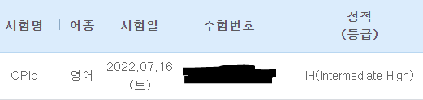

## 성적발표일까지의 생각들
시험을 마치고 나서 들었던 생각들은 'IM은 그냥 넘기겠네'과 '조금 더 공부할걸'이였다.

질문을 듣고 말하는데 크게 어려움은 없었고, 원래 목적이었던 졸업영어성적은 안봐도 넘었다는 생각이 들었다.

하지만 막상 생각해보니 문제 중 하나의 답이 생각이 나지 않아 30초가 넘도록 filler만 말했던 것, 몇개의 문제들에서 질문에서 물어본 것들 중 마지막 한두개 정도를 답하는 것을 까먹은 것 등이 생각나 AL은 힘들겠고 IH만 받아도 감지덕지하다는 생각이 들었다.

## 이 정도면 만족
이미 오후 1시에 성적이 발표된다는 걸 알고 있음에도 수시로 오픽 웹사이트에 들어가 성적확인 버튼을 눌렀다. 점심을 먹고 성적을 확인하고 IH를 받은 것을 확인했을 때 뭔가 시원섭섭한 느낌이 들었다. 

원래 생각하던 점수가 나왔고, 당연히 반나절 공부한것 치고는 잘나온 것이 맞긴 한데 아쉬운 점들만 잘 보완했으면 AL을 받지 않았을까 하는 생각이 들었다.

IH가 절대 낮은 점수가 아니고, 취업할 때도 이득을 보면 봤지 절대 불이익을 보는 점수도 아니기 때문에 일단 오픽 공부는 여기서 멈추기로 했다.

지금 당장 급한 점수는 채웠고 현재 가장 시급한건 오픽도 토익도 아닌 내가 가장 약한 한국사 자격증이기 때문에 그걸 먼저 공부해야한다.

내년 취업활동을 하며 AL이 정말 필요하다고 느끼면 그때가서 또 공부를 하게 될것 같다.


```toc

```