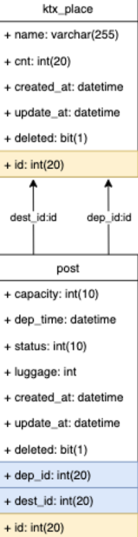

### 1주차에는 뭘했나?
1주차부터는 대면으로 만나기 시작했다. 바로 개발로 들어가기 전에 전체적으로 서비스가 어떻게 동작하는지, 폴더의 구조와 각 파일이 무엇을 위한 파일인지, 파일 속 메소드들이 어떤 역할을 하는지 정리하는 공부를 먼저 했다. 자세하게 정리하려고 하다보니까 시간도 많이 들고 읽는데 조금 힘들었지만 한번 읽고 나니까 서비스에 대한 이해가 확실히 늘었다는 느낌을 받았다. 이후에는 내가 추가할 기능인 KTX 4인승 채팅방을 어떻게 구현할것인지와 DB 스키마를 작성했다. 이후에는 기능 개발을 시작했다.


### 어려웠던 점
이전에는 기능을 바로바로 만들고 나중에 조금씩 필요한 것을 추가하는 식으로 개발을 했어서 이렇게 DB의 구조를 미리 작성하고 개발하는 형식이 조금 생소했다. 하지만 효율적인 개발을 위해서는 꼭 필요하다는 생각이 든다.

### 보완할 점
계속해서 스크래치부터 모든걸 개발하다가 이미 어느정도 개발되어있는 프로젝트에서 개발을 하게되니까 다른 사람들의 코드를 읽고 이해하는 역량을 길러야하겠다는 생각이 들었다. 아마 현업에 들어가서도 이런 경우가 훨씬 많을거라 확실히 도움이 될거라는 생각이 들었다.

```toc

```